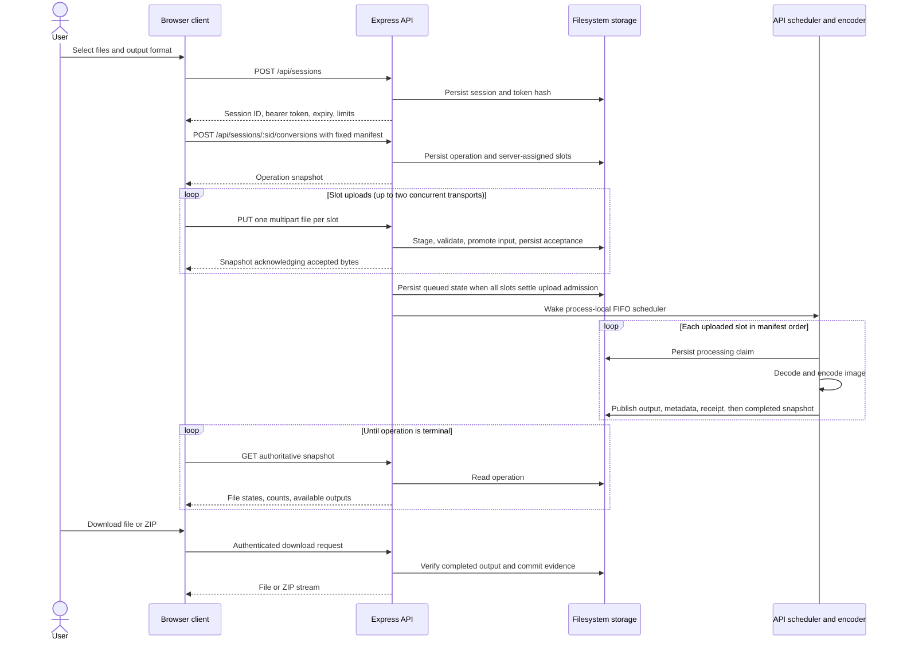

# Process a conversion batch

**Scenario:** a user submits one batch through the active browser route. Participants correspond to the [container view](../static/containers.md); the API internals are expanded in [API components](../static/components/api.md).

The operation manifest and output format cannot change after creation. A matching request ID and intent reuses the operation; a different intent for the session returns a conflict. Upload admission checks authorization, slot identity, and process capacity before multipart parsing. A disconnected or incomplete transfer leaves its slot retryable; an accepted slot cannot be overwritten. The browser reconciles an uncertain upload with a status read before retrying. Polling is observational: the API scheduler advances queued work without a browser status request.

Permanent slot failures allow the batch to progress once no slot awaits upload. Individual conversion failures preserve successful siblings; aggregate status becomes `completed`, `partially_completed`, or `failed` from the file outcomes. A user cancellation stops future uploads and requests a cooperative backend stop. The active encoder may settle successfully, while later files are skipped; already committed downloads remain available until expiry. A conversion deadline likewise waits for the invocation to settle before releasing its worker slot. See [quality requirements](../quality/requirements.md) for the resource and recovery limits.
