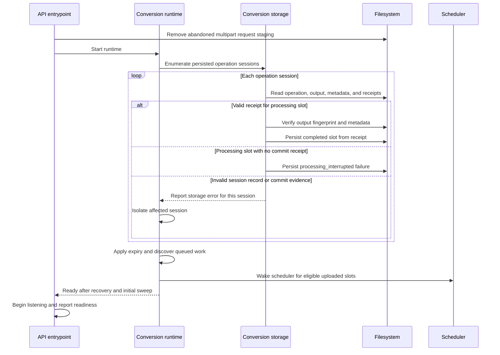

# Recover conversion state after restart

**Scenario:** the API process restarts after an interrupted upload or conversion. The sequence describes startup before the service accepts requests.

An interrupted request body is not an accepted input. Recovery preserves valid committed outputs and can finish a snapshot update when the image, metadata, and receipt were already published. A processing slot with no receipt fails rather than being silently retried; remaining uploaded slots can continue. A corrupt receipt or completed output is reported and isolates that session. Expired operations stop and are cleaned only when no conversion or download lease uses their files. Storage mutation failures stop scheduling and readiness. The periodic sweep rediscovers ready work without relying on browser polling.
