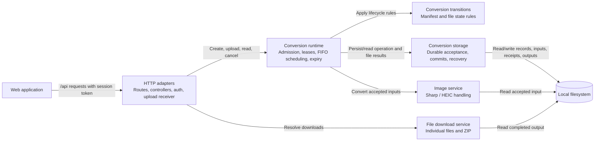

# API Components

**Scope:** the Express API process in the [container view](../containers.md). Arrows show the main call or data direction.

The HTTP adapters authenticate and validate requests before staging upload bodies. The runtime admits operations and per-slot uploads, owns the one-file-at-a-time worker, and holds leases so expiry cleanup waits for active use. Pure transition functions define valid operation and file states. Storage serializes mutations and publishes each output with commit evidence. The file service streams completed images and ZIP archives independently of sibling file outcomes. `libs/schemas` defines public request and snapshot contracts used by both browser and API.
