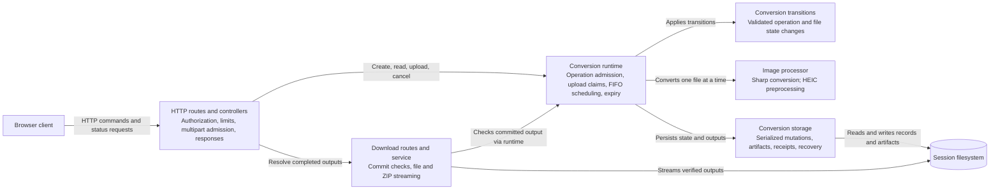

# Conversion API components

**Scope:** the Express API container in the [container view](../containers.md). This C4 component view follows the active conversion operation workflow; legacy sealed-session download handlers remain mounted for existing records.

The HTTP boundary validates the session bearer token before reading an upload body. `conversion-runtime.service.ts` owns process-local admission, scheduling, expiry, and shutdown. `conversions.service.ts` defines state transitions; `conversion-storage.service.ts` serializes mutations and verifies committed output before download. `image.service.ts` wraps encoding. Status GETs read snapshots and do not drive scheduling.

The process entrypoint removes abandoned request staging and starts recovery before listening. Storage failures that make scheduling unsafe affect readiness; invalid records are isolated by session. See [conversion processing](../../dynamic/process-conversion.md) and [restart recovery](../../dynamic/recover-conversions.md).
