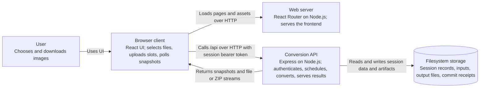

# Container view

**Scope:** Image Web Convert. These are runtime and deployment boundaries, rather than Nx packages or Docker containers. The [context view](context.md) shows the surrounding user.

The browser-facing `/api` path is proxied to the API by Vite during development. A deployment needs equivalent routing, or a configured `VITE_API_URL` and matching API CORS origin. React Router server rendering is enabled. The browser retains session credentials only in the active page session; the API stores their hashes in session records.

`libs/schemas` supplies Zod HTTP contracts to both applications. `libs/ui` supplies reusable React UI, while `libs/node-shared` and `libs/observability` support Node code. They are source libraries inside the above containers, not separate runtime services. See [API components](components/api.md) and [deployment](deployment.md).
