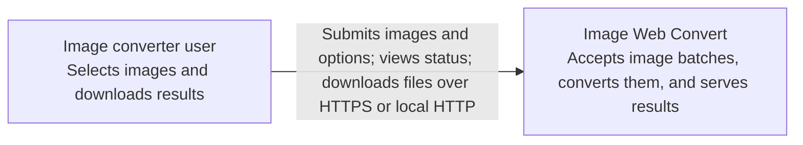

# System context

**Scope:** Image Web Convert as a single software system. This C4 context view shows the user and system boundary; internal runtime elements appear in the [container view](containers.md).

The user's image files originate on their device. The system returns converted files or ZIP downloads to that device. It does not rely on an external identity provider, database, or queue in the current design. Session bearer tokens are issued by the API. See [constraints](../quality/constraints.md) for the resulting trust and hosting boundaries.
