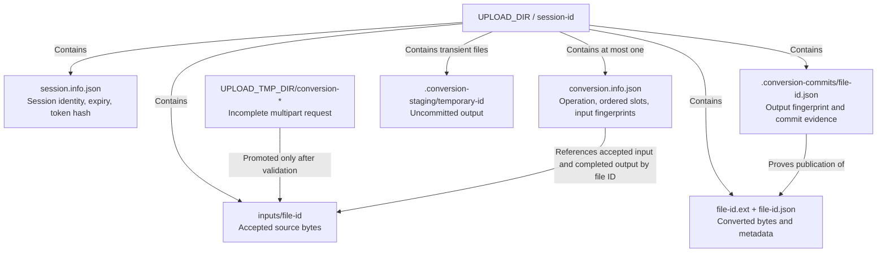

# Data and persistence

**Scope:** authoritative data for the active conversion workflow under the API filesystem root. This is a logical ownership view; [`storage.paths.ts`](../../../apps/api/src/services/storage.paths.ts) and the storage schemas define exact paths and fields.

The session record owns authentication and expiry. The operation record owns manifest membership, state revisions, per-file outcomes, and accepted input fingerprints; response counts are derived rather than separately stored. Completed output publication writes the image and metadata, then a receipt, then the updated operation snapshot. A download requires a completed slot and matching receipt, metadata, and output fingerprint. Recovery reconciles a valid receipt after a crash between publication and snapshot persistence. A processing slot with no receipt becomes `processing_interrupted`; corrupt commit evidence isolates the session for investigation.

Temporary request bodies are outside authoritative session storage. Input bytes and operation records share the storage root so the API can reconcile promotion and commit steps. The storage layer uses serialized local mutations and filesystem atomic writes, but the files do not form a single database transaction. Legacy sealed sessions use the older file layout and remain readable until their original expiry.
