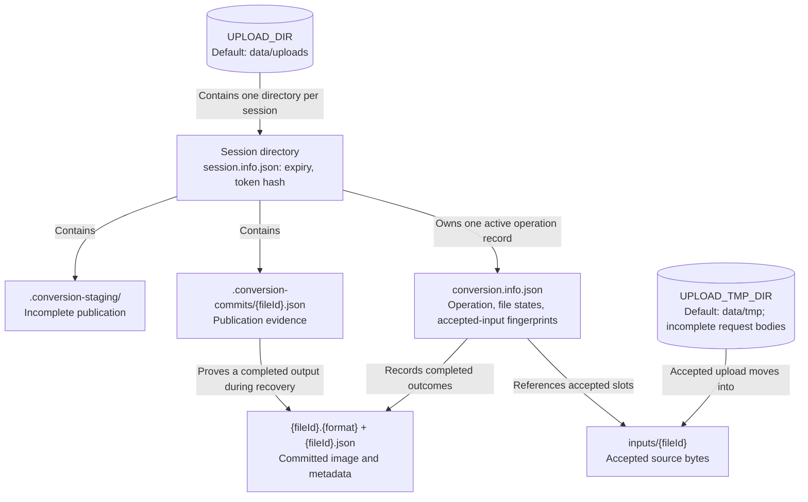

# Data and Persistence

**Scope:** the API's local filesystem model for active conversion operations. [`storage.paths.ts`](../../../apps/api/src/services/storage.paths.ts) and storage schemas define exact paths and fields.

The token hash stays in the session record; public operation snapshots are an allowlisted projection. Operation state is written atomically and validated when read. Accepted inputs have byte count and SHA-256 fingerprints. Per-file output receipts allow restart recovery to recognize a completed publication even if the operation snapshot was interrupted. Temporary request bodies and incomplete output staging are removed after settlement or on startup. Expired active operation directories are removed only after active conversion and download leases finish; legacy-only session directories are outside that operation sweep.
