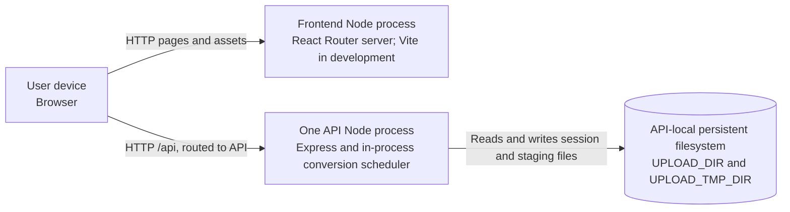

# Deployment view

**Scope:** the repository's supported local topology and the constraints a hosting topology must preserve. No production platform or provider is defined here.

Locally, Vite serves the frontend on port 4200 and proxies `/api` to the API on port 4201. The production browser-facing route can use a reverse proxy or application platform; that routing is not provisioned in this repository. A cross-origin API requires build-time `VITE_API_URL` and server `CORS_ORIGIN` configuration.

The API scheduler and mutation claims are process-local. Only one API process may own a storage root, and the root must persist across API restarts for recovery and unexpired downloads. Startup recovers storage before the API listens; `/readyz` depends on runtime readiness. Shutdown stops admission and drains active work for a configured grace period. The repository does not define a distributed worker, shared queue, database, or multi-instance storage coordination.
