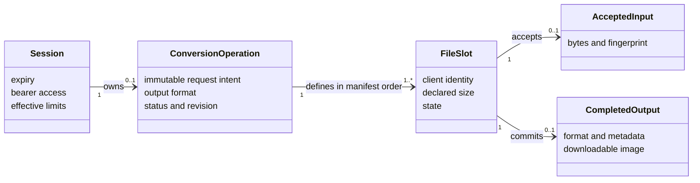

# Domain Model

**Scope:** concepts in the active conversion workflow. See [data](data.md) for persistence ownership.

A session is short lived and owns at most one active-style conversion operation. The operation fixes the file manifest and output intent; its slots receive server-assigned IDs. A slot can accept one input and reaches a completed, failed, or cancelled outcome. Completed outputs remain available even if another slot fails or cancellation is requested. A matching operation-creation retry reuses the existing operation; changed intent conflicts.
