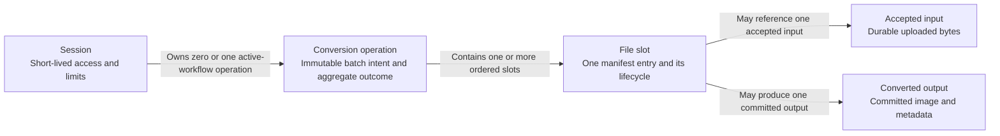

# Domain concepts

**Scope:** conceptual model of the active conversion workflow. The [data view](data.md) maps these concepts to filesystem records.

A session supplies an ID, bearer token, effective limits, and fixed expiry. Its operation fixes output format and an ordered manifest of client-correlated, server-assigned file slots. A slot can be awaiting upload, uploaded, processing, completed, failed, or cancelled. The operation derives its aggregate status and counts from those slots; absent user cancellation, `partially_completed` means at least one success and at least one unsuccessful slot. An upload acknowledgement means durable input acceptance, while a completed slot means its output has passed the publication and commit process. Completed siblings remain available when another slot fails or the user cancels, until session expiry.
